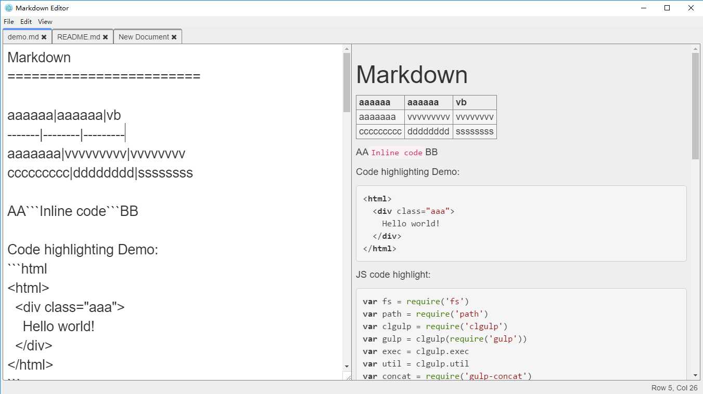

md-edit
=======

*** Still a WIP, scheduled to finish by Sep, 2016 ***

Native-app-like cross-platform Markdown Editor based on Electron, with live preview, code highlight, TeX math and PDF export support

## Features
1. Native-like app, open from/save to file system directly. Supports shortcuts.
2. Platform independent, runs on Windows & Linux & Mac OS.
3. Live preview & scroll sync.
4. Live code highlighting.
5. TeX math blocks/inline math.
6. Free WebService, export to pdf (uses LaTeX, preserves code highlight & math, coming soon)
7. Configuration & Custom Theming (Coming soon)

## Road Map
1. Partial Rerendering
2. MathQuill Intergation
3. ACE Editor w/ markdown highlighting
4. Offline PDF export w/ LaTeX & environment set-up tutorials.

## License
MIT License