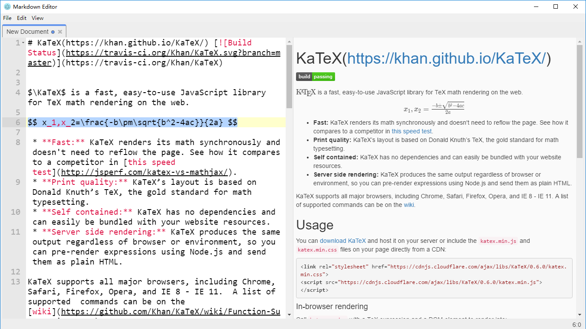

md-edit
=======

***Still a WIP, scheduled to finish by Sep, 2016***

Native-app-like cross-platform Markdown Editor based on Electron, with live preview, code highlight, TeX math and PDF export support




## Features
1. Native-like app, open from/save to file system directly. Supports recent files, cli args, dropping files, keyboard shortcuts.
2. Platform independent, runs on Windows & Linux & Mac OS.
3. Live preview & scroll sync.
4. Live code highlighting.
5. TeX math blocks/inline math.
6. Free WebService, export to pdf (uses LaTeX, preserves code highlight & math, **supports images**)
7. Vim Mode

## Road Map
1. Partial Rerendering
2. MathQuill Intergation
3. Online PDF generation with ```wkhtmltopdf``` (i.e. 2 modes for pdf generation)
4. Offline PDF export w/ LaTeX & environment set-up tutorials.
5. Configuration & Custom Theming (Coming soon)
6. Fix LaTeX bugs, provide more templates
7. Support User Tasks on Windows (right-click task bar)
8. Better syntax highlight and code block highlight for ACE-Editor
9. Support HTML & Word & RTF & epub & mobi output.
10. Improve VIM mode

## Known Problems
1. PDF generation only supports .jpg and .png images. The LaTeX approach of PDF generation is quite buggy (shall fix it later)

## License
MIT License